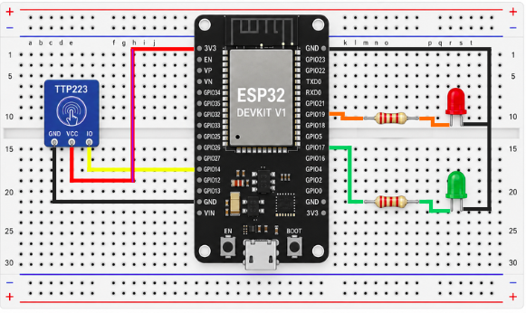

# 🔌 ESP32 — Firmware Semáforo IoT

Firmware para ESP32 DevKit V1 que controla el semáforo peatonal físico mediante un sensor táctil capacitivo TTP223 y dos LEDs.

---

## 🧰 Hardware requerido

| Componente | Cantidad |
|-----------|----------|
| ESP32 DevKit V1 (CP2102) | 1 |
| Sensor táctil TTP223 | 1 |
| LED rojo | 1 |
| LED verde | 1 |
| Resistencia 220Ω | 2 |
| Breadboard | 1 |
| Cables dupont | varios |

---

## 🔧 Conexiones

```
TTP223          ESP32
─────────────────────────
GND     →       GND
VCC     →       3.3V
IO      →       GPIO14

LED ROJO
─────────────────────────
(+) → resistencia 220Ω → GPIO17
(-) → GND

LED VERDE
─────────────────────────
(+) → resistencia 220Ω → GPIO19
(-) → GND
```



---

## ⚙️ Configuración

### 1. Instala PlatformIO en VSCode

Extensiones → buscar **PlatformIO IDE** → Instalar

### 2. Clona el repositorio y abre la carpeta `ESP32_Sensor-Toque` en VSCode

### 3. Edita `src/main.cpp` y actualiza la IP del servidor

```cpp
const char* SERVER_EVENTO = "http://TU_IP_AWS:3000/api/evento";
const char* SERVER_ESTADO = "http://TU_IP_AWS:3000/api/estado";
```

### 4. En Linux, agrega permisos de puerto serie

```bash
sudo usermod -a -G dialout $USER
sudo usermod -a -G tty $USER
# Cierra sesión y vuelve a entrar
```

### 5. Sube el firmware

```
PlatformIO → Upload  (Ctrl+Alt+U)
```

---

## 📶 Configuración WiFi

La primera vez que enciende el ESP32 o cuando no encuentra red guardada:

1. Crea un punto de acceso WiFi llamado **`Semaforo-IoT`**
2. Contraseña: **`semaforo123`**
3. Conéctate desde tu celular o PC
4. Abre el navegador en `192.168.4.1`
5. Selecciona tu red WiFi y escribe la contraseña
6. El ESP32 se reconecta automáticamente y guarda la configuración

### Cambiar WiFi sin tocar el código

Mantén presionado el botón **BOOT** durante **3 segundos**. Los LEDs parpadearán 3 veces como confirmación y el portal WiFi se activará nuevamente.

---

## 🧠 Lógica del firmware

El firmware usa los **2 núcleos del ESP32** de forma eficiente:

| Núcleo | Tarea |
|--------|-------|
| Núcleo 0 | HTTP requests (polling + eventos) |
| Núcleo 1 | Lectura del sensor + control de LEDs |

Esto evita que las llamadas HTTP bloqueen la detección del sensor.

### Estados de los LEDs

| Estado servidor | LED Rojo peatón | LED Verde peatón |
|----------------|-----------------|------------------|
| `verde` | 🔴 Encendido fijo | ⚫ Apagado |
| `ambar` | 🔴 Parpadeando | 🟢 Parpadeando |
| `rojo`  | ⚫ Apagado | 🟢 Encendido fijo |

---

## 📦 Dependencias

```ini
lib_deps =
    tzapu/WiFiManager @ ^2.0.17
    bblanchon/ArduinoJson @ ^6.21.3
```

PlatformIO las descarga automáticamente al compilar.
