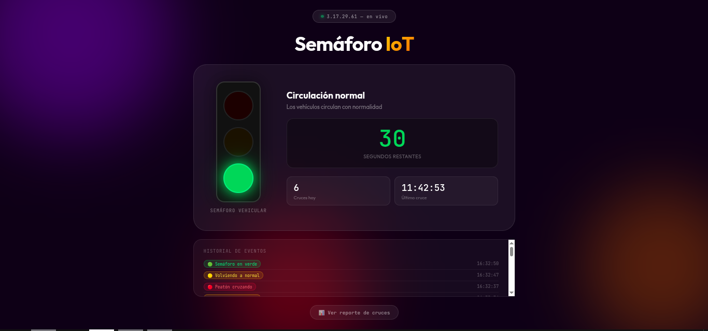
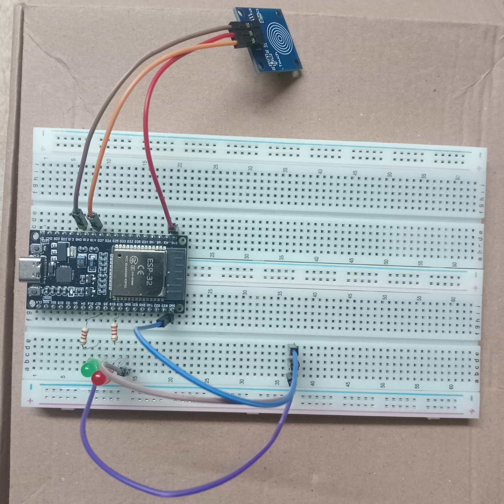

# 🚦 Semáforo IoT

Sistema de semáforo peatonal inteligente controlado por un sensor táctil capacitivo (TTP223) conectado a un ESP32, con dashboard en tiempo real desplegado en AWS.



---

## 📐 Arquitectura

```
Peatón toca sensor
       ↓
   ESP32 (WiFi)
       ↓  HTTP POST
Servidor Node.js (AWS EC2)
       ↓  WebSocket
  Dashboard Web (Apache)
```

El flujo completo:
- El peatón toca el sensor TTP223
- El ESP32 envía un evento al servidor via HTTP POST
- El servidor gestiona los tiempos y estados del semáforo
- El servidor notifica via WebSocket al dashboard en tiempo real
- El ESP32 hace polling cada 500ms y actualiza los LEDs físicos según el estado del servidor

---

## 📁 Estructura del repositorio

```
Semaforo_IoT/
├── ESP32_Sensor-Toque/       # Firmware del ESP32
│   ├── src/
│   │   └── main.cpp
│   └── platformio.ini
├── Servidor/
│   ├── Servicio/             # Backend Node.js
│   │   ├── server.js
│   │   └── package.json
│   └── Frontend/             # Dashboard web
│       └── index.html
├── imgs/                     # Capturas e imágenes del proyecto
│   ├── dashboard.png
│   └── circuito.png
└── README.md
```

---

## ⚡ Estados del semáforo

| Estado | Semáforo vehicular | LED peatón | Duración |
|--------|-------------------|------------|----------|
| Normal | 🟢 Verde | 🔴 Rojo fijo | 60 segundos |
| Transición | 🟡 Ámbar | 🔴 Rojo parpadea | 3 segundos |
| Peatón cruza | 🔴 Rojo | 🟢 Verde fijo | 10 segundos |
| Volviendo | 🟡 Ámbar | 🟢 Verde parpadea | 3 segundos |

---

## 🛠️ Tecnologías

| Capa | Tecnología |
|------|-----------|
| Hardware | ESP32 DevKit V1, TTP223, LEDs |
| Firmware | C++ / Arduino Framework / PlatformIO |
| Backend | Node.js, Express, WebSocket (ws) |
| Frontend | HTML, CSS, JavaScript vanilla |
| Infraestructura | AWS EC2 Ubuntu, Apache, PM2 |

---

## 🚀 Inicio rápido

1. Clona el repositorio
2. Configura y sube el firmware al ESP32 → ver [ESP32 README](ESP32_Sensor-Toque/README.md)
3. Despliega el servidor en AWS → ver [Servidor README](Servidor/README.md)
4. Abre el dashboard en el navegador

---

## 📸 Capturas

| Dashboard | Circuito | Foto |
|-----------|----------|
|  |  |  |

---

## 📊 API Endpoints

| Método | Endpoint | Descripción |
|--------|----------|-------------|
| POST | `/api/evento` | ESP32 envía eventos |
| GET | `/api/estado` | ESP32 consulta estado actual |
| GET | `/api/historial` | Historial de eventos en vivo |
| GET | `/api/reporte?fecha=YYYY-MM-DD` | Reporte de cruces por fecha |
| GET | `/api/reporte/all` | Resumen de todas las fechas |

---

## 👤 Autor

Denis Jair Cancinas Cardenas
